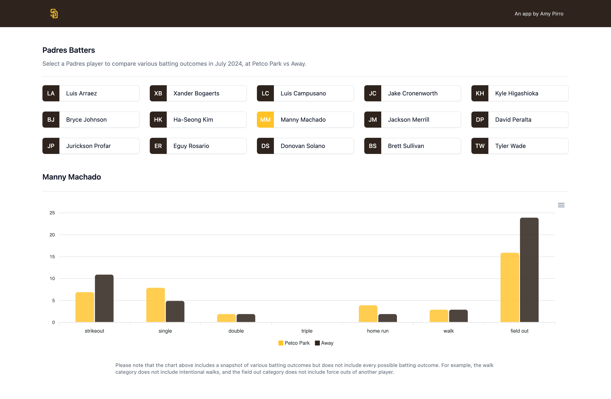

# A small Padres app by Amy Pirro

Thank you for the opportunity to create this application for your consideration in the interview process. This simple app allows the user to select a Padres player and view various batting outcomes at home vs away during July 2024.

## Tech stack

- database: SQLite
- backend: Python, FastAPI, SQLAlchemy
- frontend: JavaScript, React, ApexCharts, Tailwind

# Run this app locally

1. Clone this repository: `git clone https://github.com/amypirro/padres-jul2024-pitch-data.git`
2. `cd` into the cloned repo directory
3. In terminal enter command: `cd backend`
4. Create and activate virtual environment
5. Enter command: `pip install -r requirements.txt`
6. Enter command: `python main.py`
    - this will run the backend and show logs in your terminal
    - navigate to http://localhost:8000/docs in browser for FastAPI docs (endpoints)
7. In new terminal enter command: `cd ../frontend`
8. Enter command: `npm install`
9. Enter command: `npm run dev`
10. Navigate to http://localhost:5173/ in browser to view app

# Improvements / if I had more time

- use Docker to run project
- considerations for eventual deployment, e.g. use PostgreSQL instead of SQLite
- backend: moving business logic from pitch_routers.py to separate service
- more robust error handling, backend and frontend
- learning/using D3
- frontend: collapse Padres players cards into a dropdown on smaller screens
- and of course, including many many many more ways to view and analyze data